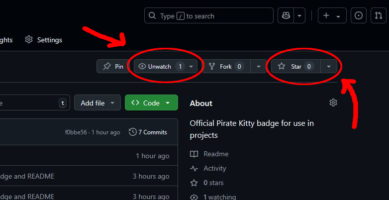
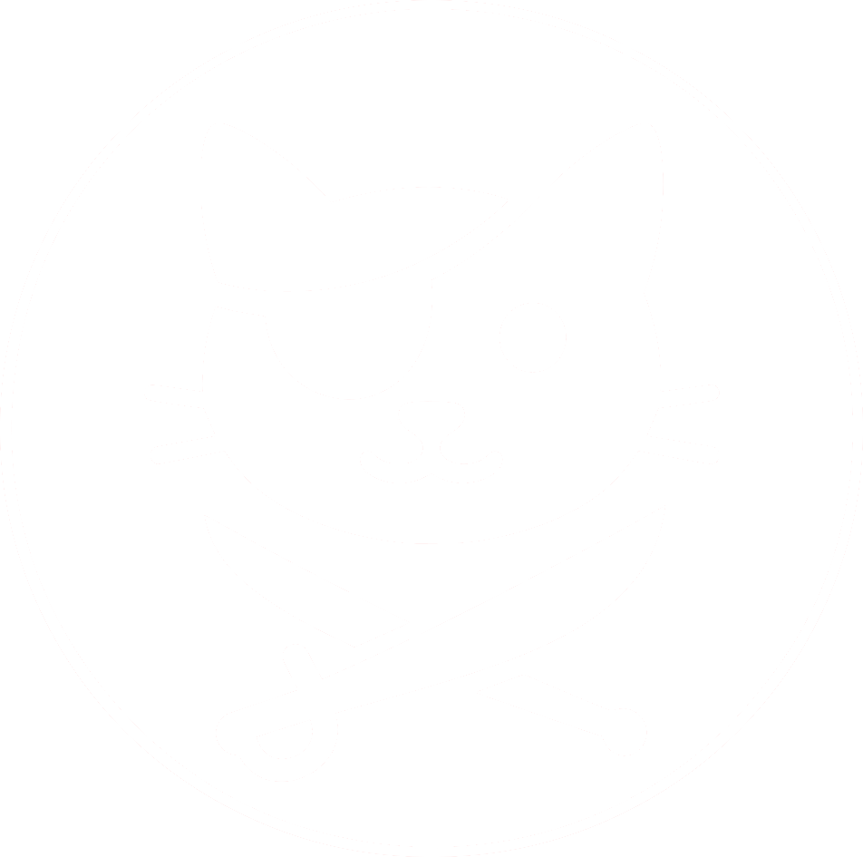
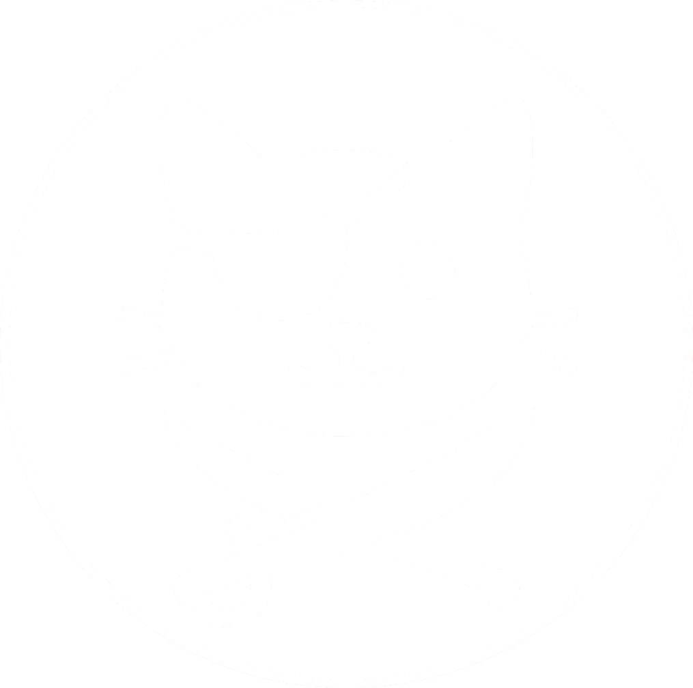
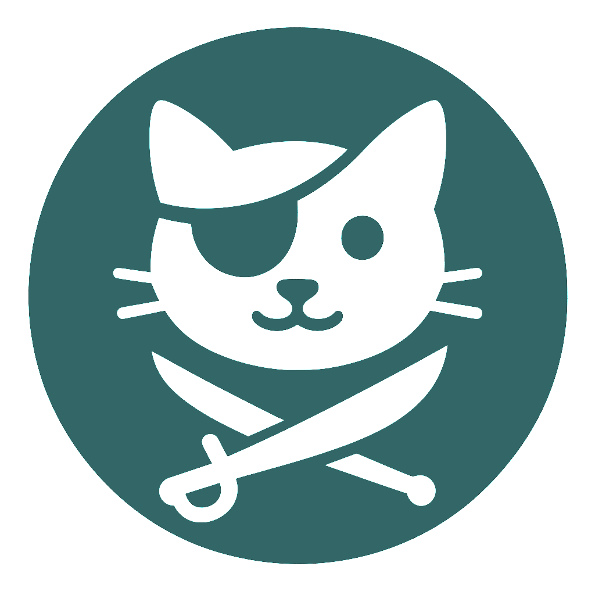
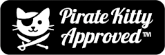

# 🐱‍👤 Pirate Kitty Badges

## ⚓️ About  
Official “Pirate Kitty Approved™” badge for use in projects, student portfolios, and adventurous HTML/CSS repos. Show off your style and pirate kitty pride! 🏴‍☠️ This is just a pet project that I'm doing for "morale purposes" but I'm hoping Pirate Kitty becomes our rogue mascot: chaotic neutral, HTML-loving, and always ready to pounce.

Badge uses a clean, GitHub-compatible style. Optimized for Markdown and project READMEs.

I'm also working on a way to count how many times Pirate Kitty has been seen using a Python Flask backend. If I really start working on that in earnest, I'll add the repo link here. If you're an aspiring backend Python dev like me, or you're just interested, be sure to Star and Watch this repo in the upper right as shown in the image below:




## 🏴 Pirate Kitty Badges
(usage / code snippets in [How to Use](#-how-to-use) section)

[](https://github.com/JCBrown602/pirate-kitty-badges)

[](https://github.com/JCBrown602/pirate-kitty-badges)
[](https://github.com/JCBrown602/pirate-kitty-badges)

[](https://github.com/JCBrown602/pirate-kitty-badges)
[](https://github.com/JCBrown602/pirate-kitty-badges)





<br />
<br />

## ✅ How to Use

Add this Markdown to your project’s README:

```markdown

```
Or make it clickable:
```markdown
[](https://github.com/JCBrown602/pirate-kitty-badges)
```

Other versions:

- Flat Square

```markdown

```

- Plastic

```markdown

```

- Big, Flat Square

```markdown

```


## 📁 File Structure

```plaintext
├── README.md
└── assets/
    └── pirate-kitty-approved.png
```

## 📜 License

## 🌍🧑‍🤝‍🧑 Share with Classmates

You can use the official badge in your own README.md by copying this Markdown:

```markdown

```

Optional: Link the badge back to this repo to help grow the Pirate Kitty movement! 🐱‍👤
